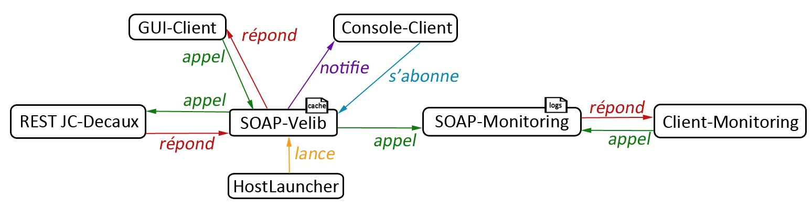

# SI4 : Service oriented computing - Web Services 

## Auteur
[Pierre RAINERO](pierre.rainero@hotmail.fr)

## Extensions
 - Graphical User Interface for the client 
 - Replace all the accesses to WS (beetween Velib WS and IWS, between IWS and WS Clients) with asynchronous ones.
 - Add a cache in IWS, to reduce communications between Velib WS and IWS.
 - Extend IWS with monitoring functionalities, i.e. various indicators that you can get and compute about the IWS activity. All this information will be accessible through a second WS attached to IWS. A specific client will be developed to access to this Monitor WS remotely. This specific client will display some of this monitor information graphically.  

## Ordre de lancement
Pour que tous les projets fonctionnent correctement il est nécessaire de les lancer dans un certain ordre :  
 1. Client-Console_Monitoring
 2. Wcf_SOAP-Velib
 3. _Le projet/fonctionnalité que vous souhaiter tester_   

Voir "Architecture du projet".

## Architecture du projet
Le dépôt courant est composé de 5 projets (de manière à bien décomposer en cas de client/serveur) :  
 1. **Client_Console-Velib :** Projet client console qui communique via un protocol SOAP avec le service fournit par le projet `Wcf_SOAP-Velib`. Une fois le projet `Wcf_SOAP-Velib` lancé, puis ce projet lancé, tapez `help` pour voir les commandes disponibles. Vous pourrez intéragir via la console Windows.    
 → Ce projet utilise les méthodes synchrones (séquentielles classiques) fournies par le service SOAP.  
 _L'API publique est documentée._

 2. **Client_GUI-Velib :** Projet client disposant d'une interface graphique qui communique via un protocol SOAP avec le service fournies par le projet `Wcf_SOAP-Velib`. Lancez `Wcf_SOAP-Velib`, puis ce projet. L'utilisation est assez intuitive (interface épurée). Vous pourrez noter le (court) temps où les comboBox deviennent vierges avant de se remplir. Cela est dû aux méthodes asynchrones (on lance la méthode pour la remplir, puis on la vide sans attendre le résultat ; en séquentiel c'est si rapide qu'on ne voit même pas le changement puisqu'on attend d'avoir le contenu pour vider et remplir).   
 → Ce projet utilise les méthodes asynchrones fournit par le service SOAP.   
 _L'API publique est documentée._  

 3. **Wcf_SOAP-Velib** : Projet WCF (bibliothèque) qui fournit un service SOAP communiquant avec l'API de JC Decaux qui suit l'architecture REST.  
 _L'API publique est documentée._  

 4. **Monitoring** : Le dossier `monitoring` est composé de deux projets. Le premier `Wcf_Monitoring` va créer un service WCF (comme pour le service SOAP-Velib) qui va gérer les logs. Il va être appelé par `Wcf_SOAP-Velib` à chaque fois que celui-ci est appelé, la persistence est gérée de la même manière que pour le cache (voir section suivante). Ce service est également référencé par le projet `Client-Console_Monitoring` qui a un comportement analogue à `Client_Console-Velib`, et permet via un terminal de consulter divers données comme le nombre de requêtes pour une période donnée ou le délais moyen d'une méthode communiquant avec l'API REST JC Decaux. On l'architecture suivante :    
 

### **Cache**
Le système de "cache" est ajouté dans le projet `Wcf_SOAP-Velib`.   
La classe `Cache` est responsable de son fonctionnement. Un objet de cette classe va stocker la liste des villes de l'API et pour chacune la liste de ses stations ; chaque information (ville ou liste de stations) est associée à une date qui correspond au moment où l'information a été obtenue.    
L'instance de la classe `Cache` dispose d'une durée (de base de 5min qui est configurable), si une nouvelle requête est effectuée dans un délai inférieur à la durée alors on va aller se servir des données stockées, sinon on va supprimer ces données et faire une requête (qui iront à leur tour dans le cache). Pour gérer la persistence on écrit/lit le cache (dans le dossier `Debug`) dans un fichier binaire.   
**(?)** Il a été choisi de ne pas mettre en cache le nombre de vélos par stations car cette information nécessite d'être en "temps réel".  
   
On peut apprécier le fonctionnement du cache avec le projet `Client_Console-Velib` qui affiche le temps d'exécution d'une commande, dans l'exemple suivant on voit deux appels consécutifs à la liste des villes :   
- _CITIES   
Temps d'exécution : 00:00:00.8927616   
-----------------------------------------------------------_   
- _CITIES   
Temps d'exécution : 00:00:00.1400171   
-----------------------------------------------------------_
